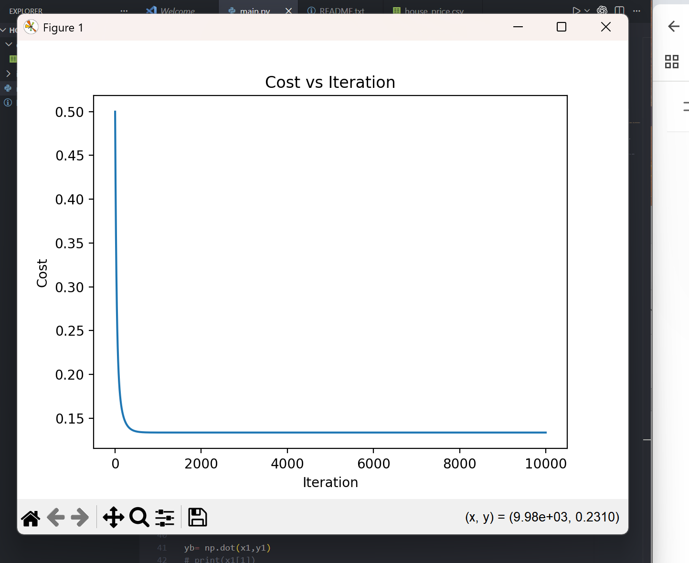
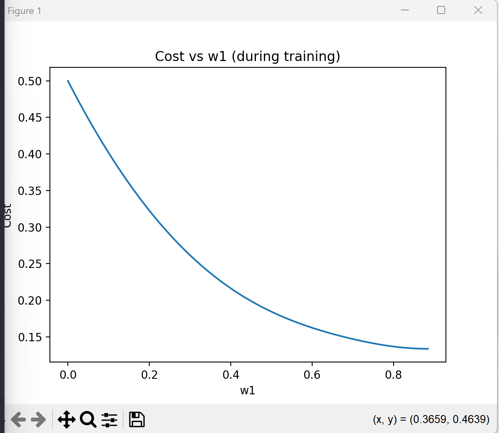
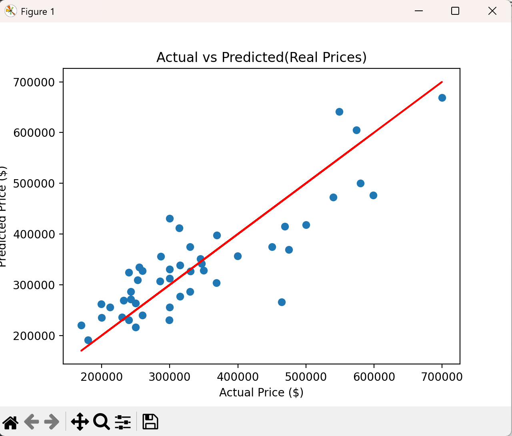

# 🏠 House Price Prediction (Linear Regression from Scratch)

## 📌 Overview

This project implements **Linear Regression from scratch** using **Gradient Descent** to predict house prices based on features such as house size and number of bedrooms.

The goal of this project is to understand how machine learning models work internally without relying on libraries like scikit-learn.

---

## ⚙️ Features

- Implemented Linear Regression from scratch
- Cost Function (Mean Squared Error)
- Gradient Calculation
- Gradient Descent Optimization
- Feature Scaling using **Z-score Normalization**
- Visualization of:
  - Cost vs Iterations
  - Actual vs Predicted Prices

---

## 📊 Dataset

The dataset contains housing data with features such as:

- House size
- Number of bedrooms
- Price (target variable)

---

## 🧠 Methodology

### 1. Data Preprocessing

- Loaded dataset using pandas
- Converted data to NumPy arrays
- Applied **Z-score normalization** to both features and target

### 2. Model Implementation

The following components were implemented manually:

- Cost Function:

  [
  J(w,b) = \frac{1}{2m} \sum (f(x) - y)^2
  ]

- Gradient Calculation

- Gradient Descent to update weights and bias

---

### 3. Training

- Initialized weights and bias
- Used gradient descent to minimize cost
- Tuned learning rate and iterations for convergence

---

## 📈 Results

### Cost vs Iteration



This graph shows how the cost decreases over time, indicating that gradient descent is converging.

---

### Cost vs w₁



This graph shows how the cost changes with respect to one of the model parameters (w₁) during training.
It helps visualize how gradient descent moves towards the minimum.

---

### Actual vs Predicted Prices



- Blue points represent predicted values
- Red line represents perfect predictions (y = x)

---

## 🧪 Evaluation

Mean Squared Error (MSE) is used to evaluate model performance.

---

## 🚀 Key Learnings

- Importance of **feature scaling** for stable training
- Effect of **learning rate** on convergence
- Understanding how gradient descent updates parameters
- Difference between normalized values and real-world values

---

## 🔮 Future Improvements

- Implement model using **scikit-learn** for comparison
- Add train/test split for better evaluation
- Include more features for better predictions
- Improve model performance

---

## 🛠️ Technologies Used

- Python
- NumPy
- Pandas
- Matplotlib

---

## 📌 How to Run

```bash
pip install numpy pandas matplotlib
python main.py
```

---

## 👤 Author

Ashdeep Singh

---
